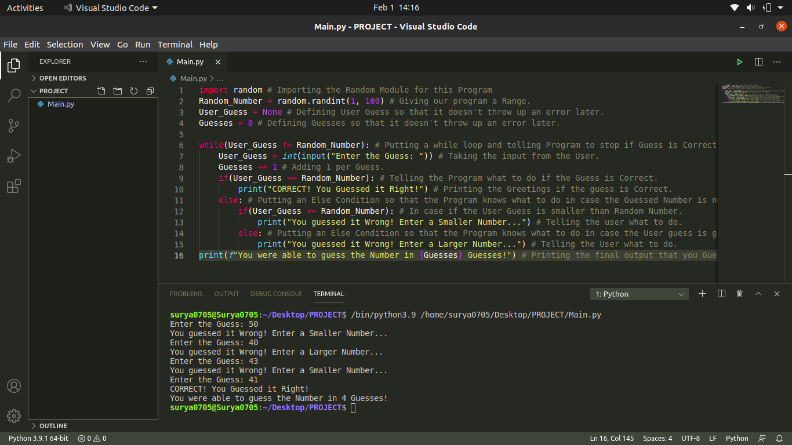

# Number_Guessing_Game
Getting Bored? This is a Python Program that gives a Random Number Guessing Game as the Output. Just run the Main.py file and the Game will start. Want to increase the Difficulty? Just change the Range in 2nd Line. It uses a built-in module Random which will be present in your System also if you have installed Python Correctly. Below is the Screenshot of My Project:

Hope that you liked it.
